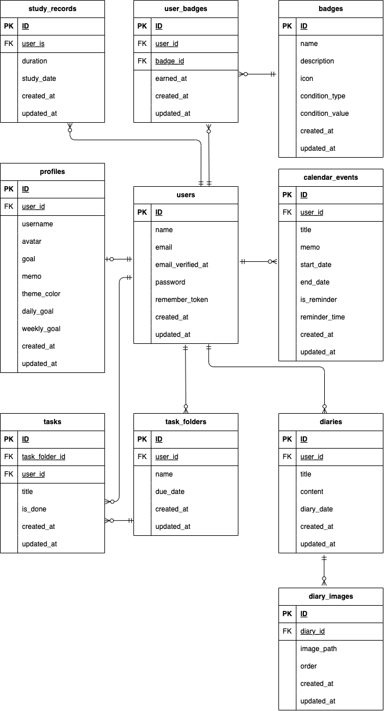

# 🏠 Life Dashboard

生活全般を管理するSPAポートフォリオアプリです。

## 💡 コンセプト

複数のアプリを使い分けることなく、カレンダー・タスク管理・学習記録・日記を一つのダッシュボードで管理できるSPAアプリです。
自分のペースで学習・成長したい方に向けて、日々の生活管理を一つにまとめました。

**「誰向け？」**

- フリーランス・副業目指して勉強している人
- 学業（自己学習）・バイトなど両立させたい人
- 日々の習慣を管理したい社会人
- 自分の成長を記録したい人

**「どんな課題を解決？」**

- カレンダー・タスク・学習記録・日記をバラバラのアプリで管理している
- 自分の学習進捗や達成感を可視化できていない
- 使うアプリを自分好みにカスタマイズしたい

---

## 🌐 デモ

> 現在ローカル環境のみで動作します。

テストアカウント（セットアップ後に新規作成してください）:

- Username:`テストユーザー`
- Email: `test123@example.com`
- Password: `Password123!`

---

## 🏗 アーキテクチャ構成

┌─────────────────────────────────────────┐
│ クライアント │
│ Next.js (Vercel) │
│ ┌─────────┐ ┌─────────┐ ┌─────────┐ │
│ │Calendar │ │ Tasks │ │ Study │ │
│ └─────────┘ └─────────┘ └─────────┘ │
└──────────────────┬──────────────────────┘
│ HTTP/REST API
│ Bearer Token (Sanctum)
┌──────────────────▼──────────────────────┐
│ バックエンド │
│ Laravel 11 (API) │
│ ┌─────────────────────────────────┐ │
│ │ Laravel Sanctum (認証) │ │
│ └─────────────────────────────────┘ │
└──────────────────┬──────────────────────┘
│
┌──────────────────▼──────────────────────┐
│ データベース │
│ MySQL 8.0 │
└─────────────────────────────────────────┘
開発環境: Docker (docker-compose)

---

## 🗄 ER図



## 🛠 使用技術

### フロントエンド

| 技術                    | 用途              |
| ----------------------- | ----------------- |
| Next.js 14 (App Router) | SPAフレームワーク |
| React 18                | UIライブラリ      |
| TypeScript              | 型安全な開発      |
| Tailwind CSS            | スタイリング      |
| FullCalendar            | カレンダーUI      |
| Swiper                  | 画像スライダー    |
| Axios                   | API通信           |

### バックエンド

| 技術            | 用途               |
| --------------- | ------------------ |
| Laravel 11      | APIサーバー        |
| PHP 8.4         | サーバーサイド言語 |
| Laravel Sanctum | トークン認証       |
| MySQL 8.0       | データベース       |

### インフラ

| 技術   | 用途                       |
| ------ | -------------------------- |
| Docker | 開発環境の統一             |
| GitHub | バージョン管理・CI         |
| Vercel | フロントエンドホスティング |

---

## ✨ 機能一覧

### 🔐 認証

- 新規登録・ログイン・ログアウト
- Laravel Sanctumによるトークン認証
- プロフィール設定（スキップ可）

### 📅 カレンダー

- 月表示カレンダー（FullCalendar）
- 予定の追加・編集・削除・メモ
- リマインダー機能（ブラウザ通知）
- 日記機能（複数画像・スワイプ表示）

### ✅ タスク管理

- フォルダ式Todoリスト
- フォルダに期限日設定・期限警告表示
- タスクの完了・未完了切り替え
- 済み/未フィルター・編集・削除

### ⏱ 学習タイマー

- カウントアップタイマー
- 別ページに移動してもタイマー継続
- ログアウト時に自動リセット
- 1日・1週間の目標設定・進捗バー
- 目標達成でバッジ獲得

### 👤 マイページ

- プロフィール編集（ユーザー名・アイコン・目標・一言メモ）
- テーマカラー選択（6色・全ページに反映）
- 獲得バッジ一覧

---

## 🚀 ローカル環境のセットアップ

### 必要なもの

- Docker Desktop
- Git
- Composer

### 手順

**① リポジトリをクローン**

```bash
git clone https://github.com/Arii-sa/life-dashboard.git
cd life-dashboard
```

**② Laravelの依存パッケージをインストール**

```bash
docker compose run --rm backend composer install
```

**③ Dockerを起動**

```bash
docker compose up -d --build
```

**④ Laravelの初期設定**

```bash
docker exec -it life-dashboard-backend cp .env.example .env
docker exec -it life-dashboard-backend php artisan key:generate
docker exec -it life-dashboard-backend php artisan migrate
docker exec -it life-dashboard-backend php artisan db:seed
docker exec -it life-dashboard-backend php artisan storage:link
```

**⑤ アクセス確認**

| サービス        | URL                   |
| --------------- | --------------------- |
| フロントエンド  | http://localhost:3000 |
| バックエンドAPI | http://localhost:8000 |
| phpMyAdmin      | http://localhost:8080 |

---

## 📁 ディレクトリ構成

```
life-dashboard/
├── frontend/          # Next.js
│   └── src/
│       ├── app/       # App Router（ページ）
│       ├── components/# 共通コンポーネント
│       ├── contexts/  # Context API（認証・テーマ・タイマー）
│       └── lib/       # axios設定
├── backend/           # Laravel
│   ├── app/
│   │   ├── Http/Controllers/Api/
│   │   └── Models/
│   ├── database/migrations/
│   └── routes/api.php
└── docker-compose.yml
```

---

## 🎨 設計のポイント

- **SPA設計**: Next.js App RouterによるSPA構成
- **REST API**: LaravelによるRESTful API設計
- **認証**: Laravel SanctumによるトークンベースのAPI認証
- **状態管理**: React Context APIによるグローバル状態管理
- **テーマ**: ユーザーごとのテーマカラーをContext経由で全体に反映
- **タイマー永続化**: localStorageでタイマー状態を管理しページ遷移後も継続

---

## 🌿 ブランチ戦略

```
main        本番用（動くものだけ）
feature/*   各機能開発
```

| ブランチ           | 内容                             |
| ------------------ | -------------------------------- |
| feature/auth       | 認証・プロフィール機能           |
| feature/navigation | ナビゲーションバー・テーマカラー |
| feature/task       | タスクページ                     |
| feature/calendar   | カレンダー・リマインダー         |
| feature/study      | 学習タイマー・バッジ             |
| feature/mypage     | マイページ                       |
| feature/diary      | 日記機能                         |
| feature/design     | デザイン統一                     |

---

## 👩‍💻 開発者

**Arii-sa**

- GitHub: https://github.com/Arii-sa/life-dashboard.git
